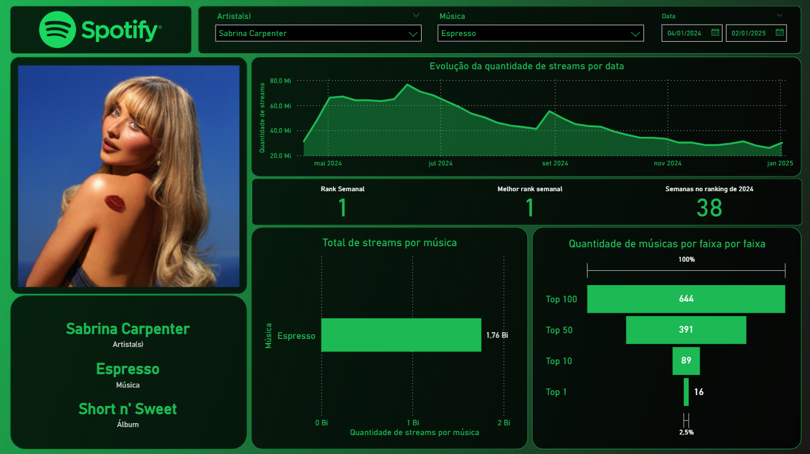
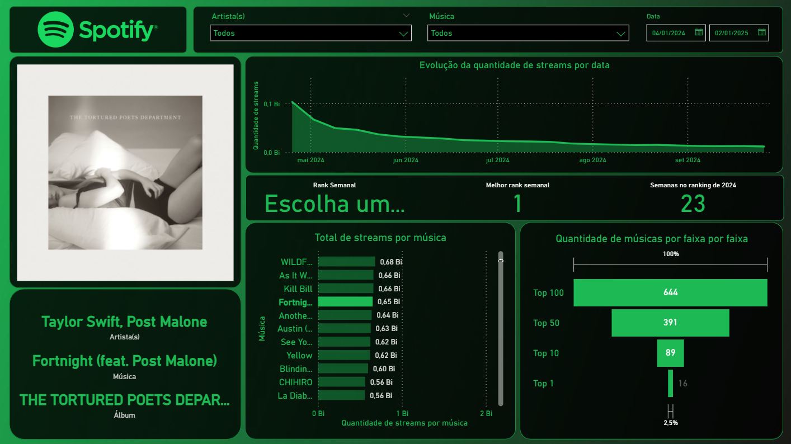

# Spotify Analysis - Power BI dashboard

## Descrição

Este projeto consiste em um dashboard interativo desenvolvido no Power BI que analisa as 100 músicas mais tocadas de cada semana de 2024, com base em dados do Spotify. O objetivo é identificar tendências e padrões de consumo musical, analisar o desempenho de artistas e músicas ao longo do ano, e apresentar insights visuais de forma clara e dinâmica.

## Fontes dos dados

- Spotify Global Chart 2024.xlsx: dataset original, publicado no kaggle por Federico Cester. Clique [aqui](https://www.kaggle.com/datasets/federicocester97/spotify-global-chart-2024) para acessá-lo.
- top_200_spotify.csv: dataset original com a adição dos álbuns das músicas e as url de suas capas via biblioteca requests do Python.
- top_100_spotify.csv: versão final do dataset, contendo os dados utilizados na análise após tratamento de dados com a biblioteca Pandas.

## Ferramentas

- Python: linguagem de programação usada para fazer requisições a API do Spotify e manipulação dos dados
- Pandas: biblioteca do python usada para fazer o pré-processamento dos dados providos pelos datasets
- Jupyter Notebook: utilizado para visualização dos dataframes pandas no pré-processamento dos dados
- Power BI: utilizado para criar o dashboard do projeto

## Etapas do projeto
- Adição de dados ao dataset com a biblioteca requests e API do Spotify
- Pré-processamento dos dados com Pandas
- Criação do dashboard dinâmico utilizando o Power BI

## Funcionalidades
- Filtro por artista, nome da música e data
- Vista de informações adicionais das músicas (álbum e imagem da capa do álbum)
- Análise de permanência das músicas no ranking. Além de destaque para o rank semanal e melhor rank geral
- Visualização das 100 músicas mais tocadas por semana escolhida ou visualização de todas as músicas com base em um intervalo de data
- Evolução das streams de músicas durante o ano ou evolução das streams das semanas ao longo do ano
- Quantidade anual de músicas por faixa do ranking

## Pré-visualização

## Como visualizar o dashboard
Cerifique-se de que tenha o Power BI Desktop instalado na sua máquina. Caso contrário, baixe e instale-o pelo [site oficial](https://www.microsoft.com/pt-br/power-platform/products/power-bi) Após isso, abra o arquivo Spotify_Dashboard.pbix.
